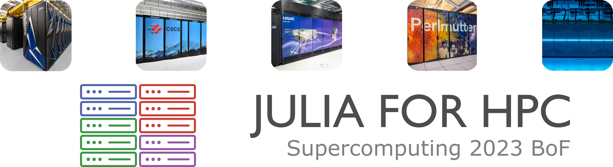

# Julia for HPC Birds of a Feather session @ SC2#

This repository contains the brief talks presented during the the "[Julia for
HPC](https://sc23.supercomputing.org/presentation/?id=bof232&sess=sess366)" Birds of a
Feather session at the
[SuperComputing23](https://sc23.supercomputing.org/)
(SC23) conference held in Dallas (Denver, USA) on Thursday, 16 November 2023

## Tentative Program:

1. 15 minutes: Lighting talks, potential topics: Julia for Exascale Computing;
   HPC software stack and vendor support; current support at facilities;
   application experiences and requirements; and uses of Julia in novel projects
   such as AI, and Quantum Computing.

2. 45 minutes: Discussion
